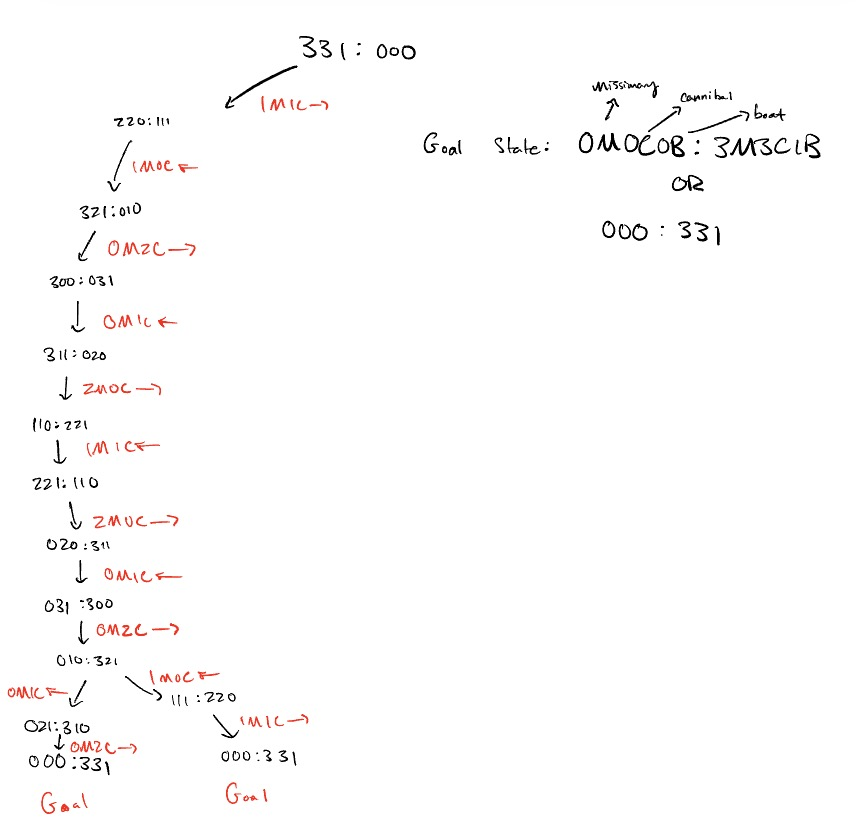
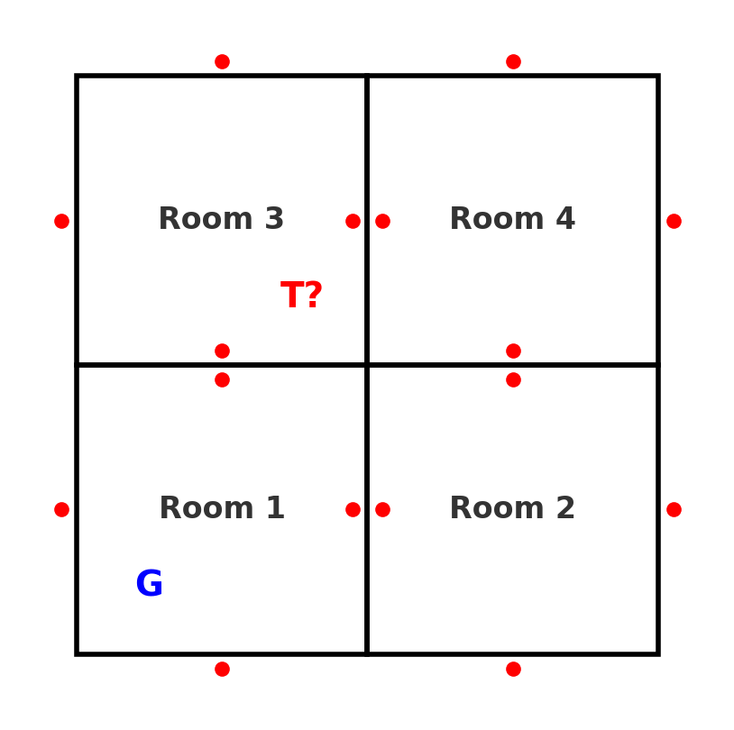
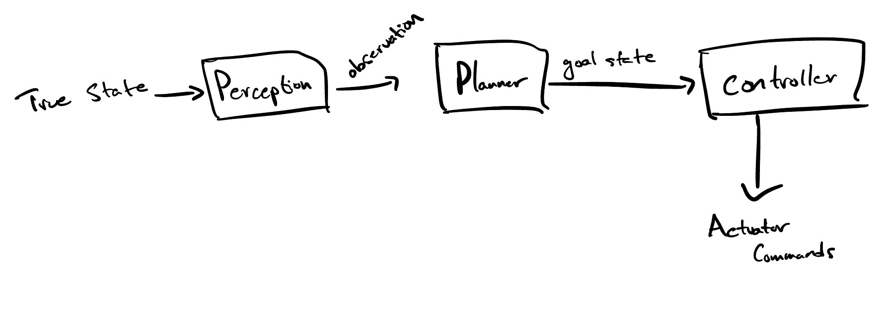
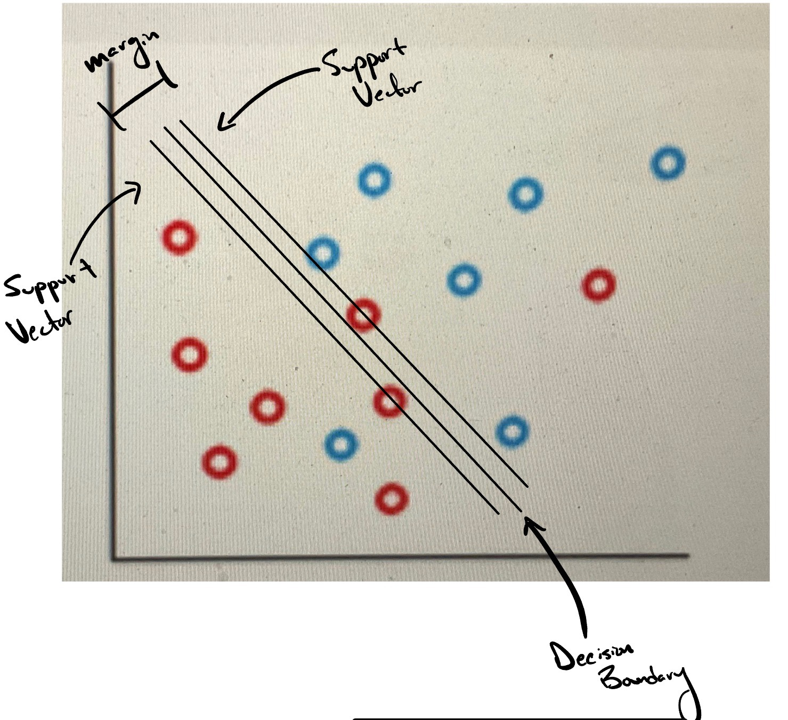

# Julian Torres
# AI For Robotics Midtern


# 1)

## a) 
State space representation is a formalism that describes problems in terms of states and the transitions between them. It provides a structured way to model problems such that they can be solved using search or other problem-solving techniques.

Key Components:
- State
- State space
- Operators 
- Initial State
- Goal State(s)
- Path (Solution)
- Cost Function 

## b)




--- 

# 2) 

## a)
- The bank consists of four rooms connected by doors
- Each room has external doors (marked in red)
- The security guard (G) starts in the bottom left room
- The thief (T) is somewhere in the bank, marked as a possible location

## b) 



### 
```python

def reflex_agent(perception):
    room, door_locked, thief_present = perception
    
    if thief_present:
        help()  # Call for help if a thief is found
    elif not door_locked:
        notUnlocked()   # Report if the door is unlocked
    else:
        ok()  # Report that everything is fine
    
    next_move = randomChoice()

class ModelBasedAgent:
    def __init__(self):
        self.visited_rooms = set()  # Track visited rooms
        self.last_known_thief_location = None

    def update_belief(self, perception):
        room, door_locked, thief_present = perception
        self.visited_rooms.add(room)

        if thief_present:
            self.last_known_thief_location = room

    def decide_action(self, perception):
        room, door_locked, thief_present = perception
        self.update_belief(perception)

        if thief_present:
            help()  # Call for help if a thief is found
        elif not door_locked:
            notUnlocked()   # Report if the door is unlocked
        else:
            ok()  # Report that everything is fine

```
---


# 3)

### a) “Every butterfly likes some flower.”

for every butterfly, there exists at least one flower that the butterfly likes : **B**

### b) "For every flower, there is a butterfly that likes that flower.”

for each flower, there is at least one butterfly that likes it: **A**

### c) “Every butterfly likes every flower.”

for all butterflies and all flowers, the butterfly likes that flower: **A**

## d) “There is some butterfly in Irvine that is pretty.”

at least one butterfly exists in Irvine and that butterfly is pretty: **B**

## e) What is Naïve Bayes algorithm? What is it used for in Machine Learning?

The Naïve Bayes algorithm is a probabilistic classifier based on Bayes’ Theorem with the naïve assumption that all features are independent given the class label.


The Naïve part comes from the assumption that the features  x_1, x_2, …, x_n  are conditionally independent given the class:


P(Y | X) = P(X | Y) P(Y) / P(X)

where:
-	 P(Y | X)  = Posterior probability (probability of class  Y  given features  X )
-	 P(X | Y)  = Likelihood (probability of features  X  given class  Y )
-	 P(Y)  = Prior probability (probability of class  Y  occurring)
-	 P(X)  = Evidence (probability of feature set  X , acts as a normalizing constant)

P(X | Y) = P(x_1 | Y) P(x_2 | Y) … P(x_n | Y)

This assumption makes the computation tractable but is often unrealistic in real-world data.

## d) For the same PC purchase dataset given in Table 1 below, develop a Naïve Bayes Classification
method, and use the same to classify the new example given below.

**Step 1: Compute Prior Probabilities**

P(yes) = 5/10 = 0.5

P(No) = 5/10 = 0.5

**Step 2: Compute Conditional Probabilities for each feature given Buys PC = Yes and Buys PC = No.**


(i) Probability of Age = Senior
	•	Buys PC = Yes → (Senior appears 2 times out of 5) → P(Senior | Yes) = 2/5 = 0.4

	•	Buys PC = No → (Senior appears 1 time out of 5) → P(Senior | no) = 1/5 = 0.2


(ii) Probability of Income = High
	•	Buys PC = Yes → (High appears 2 times out of 5) → P(high | yes) = 2/5 = 0.4

	•	Buys PC = No → (High appears 2 times out of 5) → P(high | no) = 2/5 = 0.4


(iii) Probability of Education = High School
	•	Buys PC = Yes → (High School appears 2 times out of 5) → P(high school | yes) = 2/5 = 0.4

	•	Buys PC = No → (High School appears 2 times out of 5) → P(high school | no) = 2/5 = 0.4


(iv) Probability of Prior Purchase = Yes
	•	Buys PC = Yes → (Prior Purchase = Yes appears 3 times out of 5) → P(yes | yes) = 3/5 = 0.6

	•	Buys PC = No → (Prior Purchase = Yes appears 2 times out of 5) → P(yes | no) = 2/5 = 0.4

**Step 3: Compute Posterior Probabilities**

Using Bayes’ theorem, we calculate:


P(yes | Senior, High, High School, Yes)  P(Senior | Yes) * P(High | Yes) * P(High School | Yes) * P(Yes | Yes) * P(Yes)


P(No | Senior, High, High School, Yes) is proportional to  P(Senior | No) * P(High | No) * P(High School | No) * P(Yes | No) * P(No)


Substituting values:


P(yes) = 0.5


P(no) = 0.5


For Yes:


P(Yes | Senior, High, High School, Yes) is proportional to  (0.4) * (0.4) * (0.4) * (0.6) * (0.5)


= 0.4 * 0.4 * 0.4 * 0.6 * 0.5 = 0.0192


For No:


P(No | Senior, High, High School, Yes) is proportional to  (0.2) * (0.4) * (0.4) * (0.4) * (0.5)


= 0.2 * 0.4 * 0.4 * 0.4 * 0.5 = 0.0064


**Step 4: Normalize and Make a Decision**

P(Yes | Senior, High, High School, Yes) > P(No | Senior, High, High School, Yes)

**We Classify as:  YES**

--- 

# 4) 

The given neural network consists of:
1.	Input Layer: 3 input neurons:

-	Bedrooms:  x_1 = 3 
-	Square Feet:  x_2 = 2000 
-	Neighborhood:  x_3 = 1 

2.	Hidden Layer: 4 neurons, each connected to all input neurons.

3.	Output Layer: 1 neuron providing the final price estimate.

**Hidden Layer Values**

Each hidden neuron receives input from all input neurons and applies a weighted sum operation:


Since all weights are 0.1:


h_j = 0.1 * x_1 + 0.1 * x_2 + 0.1 * x_3


Substituting values:


h_j = (0.1 * 3) + (0.1 * 2000) + (0.1 * 1)


h_j = 0.3 + 200 + 0.1 = 200.4


all hidden neurons have the same inputs and weights:


h_1 = h_2 = h_3 = h_4 = 200.4


**Output Layer Value**

y = 0.1 * 200.4 + 0.1 * 200.4 + 0.1 * 200.4 + 0.1 * 200.4

y = 80.16


**Final Price Estimate: 80.16**

--- 

# 5)

Image Preprocessing:
- Convert the image to grayscale or apply color corrections if needed.
- Resize the image to a fixed resolution to ensure uniform processing.
- Normalize pixel values to improve the efficiency of neural networks.

Detecting Faces (Human and Animal)
1.	Initial Face Detection
- Use models like MTCNN, RetinaFace, or OpenCV’s Haar cascades to locate faces within the image.
- Generate bounding boxes around all detected faces.
2.	Classification into Human vs. Animal
- Implement a CNN trained to differentiate between human and animal faces.
- Filter out any false detections by applying some probability threshold.s

Recognizing Human Faces
1.	Feature Extraction with CNN
- A deep CNN extracts facial embeddings that cpture distinct features for recognition
2.	Comparison with Known Faces
- The extracted facial features are compared against a stored database.
- Matching is performed using Euclidean distance or cosine similarity.
- If no match is found, the person is labeled as “Unknown.”

Identifying Animal Faces
1.	Animal Classification with CNN
- A separate CNN-based classifier is trained on animal datasets like Oxford-IIIT Pet Dataset.
- The model predicts the species (e.g., cat, dog) and assigns a label.
2.	Counting Animal Faces
- Count the number of unique animal faces detected.
- If multiple animals are found, classify each separately.

Face Count: Display the number of humans and animals detected.

Classification Results:

- Recognized human names (if matched in the database).

- Identified animal species (e.g., “Cat detected”).

Bounding Boxes and Labels:

- Draw labeled bounding boxes over detected faces.

- Differentiate humans from animals visually.

---
the first step is object detection and pose estimation, which can be accomplished using Simultaneous Localization and Mapping (SLAM). SLAM allows the robot to build a map of its environment while simultaneously localizing itself within it by integrating sensor data from cameras and LiDAR and using maybe a Kalman Filter as a sensor fusion algorithm. 

Next, the robot needs to determine the joint configurations required to reach the detected object’s pose, which is done by Inverse Kinematics. IK algorithms compute the necessary joint angles that place the end effector at the desired position and orientation. Methods such as Jacobian-based solvers (Newton-Raphson, Levenberg-Marquardt) or analytical solutions (if the manipulator’s kinematics allow) can be used to ensure feasible joint movements. IK is essential for ensuring the manipulator can reach the object without violating joint limits or causing singularities. Instead of Newton-Raphson or RK4, Euler's Integration method is also used. It provides a faster time to compute but trades off accuracy.

For motion planning, Rapidly-Exploring Random Trees (RRT) provides an efficient way to generate a collision-free path in the workspace.it incrementally expands a search tree in the C space, ensuring that the manipulator avoids obstacles while reaching the goal. Variants like RRT-Connect or RRT* (which improves path efficiency) help in generating smoother and more optimal paths for real-world applications. This algorithm ensures that the robot’s arm moves efficiently while avoiding obstacles in its environment.

Once a valid path is determined, it must be converted into a smooth and executable trajectory using Time-Optimal Path Parameterization (TOPP). This method assigns velocity profiles along the path while considering acceleration and jerk limits, ensuring smooth motion. By optimizing speed while adhering to actuator constraints, TOPP helps execute movements in the shortest possible time without causing abrupt changes that could destabilize the manipulator.

For something as simple as getting a robot arm to move a block, a well tuned PID controller can often suffice. But people often use things like LQR or MPC for better performance or to optimize certain performance metrics. Below is a super simple diagram that covers this at a high level. 


___

# 7) 

Support vectors are the data points that are closest to the hyperplane in a SVM model. These points are needed for defining the margin between the two classes and determine the optimal separation of hyperplane. They help in in classification by defining the decision boundary (hyperplane), maximizing the margin of (points on other side of it), and providing overall model robustness. 

